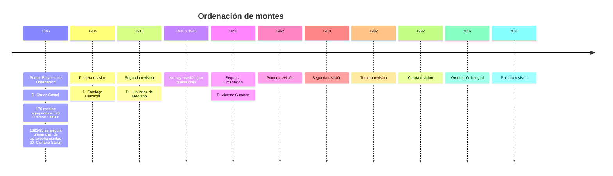

## My post 

```mermaid
timeline
        title Ordenación de montes
          1886 : Primer Proyecto de Ordenación : D. Carlos Castell : 176 rodales agrupados en 70 “Tramos Castell” : 1892-93 se ejecuta primer plan de aprovechamientos (D. Cipriano Sáinz)
          1904 : Primera revisión : D. Santiago Olazábal
          1913 : Segunda revisión : D. Luis Velaz de Medrano
          1936 y 1946: No hay revisión (por guerra civil) 
          1953 : Segunda Ordenación :  D. Vicente Cutanda
          1962 : Primera revisión
          1973 : Segunda revisión
          1982 : Tercera revisión
          1992 : Cuarta revisión
          2007 : Ordenación integral
          2023 : Primera revisión
```
